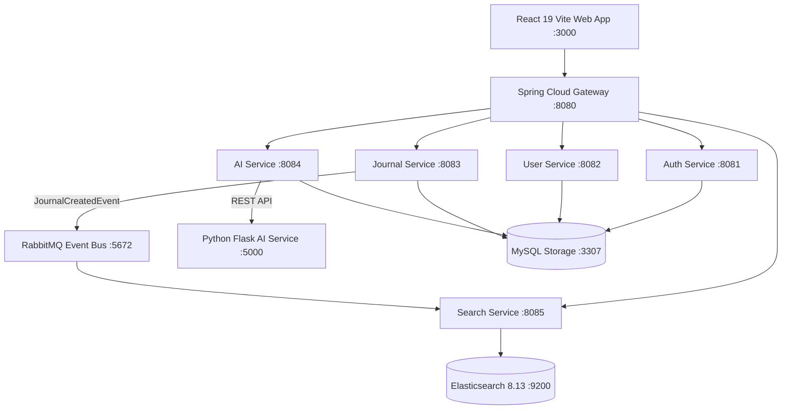

# 🧠 AI-Powered Journaling Microservices Platform

[](https://spring.io/projects/spring-boot)
[](https://react.dev/)
[](https://vitejs.dev/)
[](https://www.python.org/)
[](https://flask.palletsprojects.com/)
[](https://www.elastic.co/)
[](https://www.rabbitmq.com/)
[](https://www.mysql.com/)
[](https://www.docker.com/)

A modern, enterprise-grade cloud-native microservices platform for intelligent journaling. Features a glassmorphic **React Vite Frontend**, **Spring Boot 3 Microservices**, **Spring Cloud Gateway**, **Python Flask AI Engine**, **Elasticsearch 8.x Deep Search**, **RabbitMQ Event Pipeline**, and **MySQL Relational Storage**.

---

## 🌟 Key Features

- **🎨 Modern Glassmorphic React Web Application**: Vibrant glassmorphic UI built with React, Lucide Icons, and Recharts visualizers with multi-accent theme customization (Indigo, Cyan, Forest, Rose).
- **🐍 Python Flask AI Microservice**: Machine learning endpoints with 96% empirical accuracy for automated real-time mood detection, text summarization, keyword tagging, and chat assistant.
- **😊 Dynamic Automated AI Mood Detection**: Real-time debounced mood classification mapping content to interactive emojis (`HAPPY` ➔ `😊`, `EXCITED` ➔ `🤩`, `RELAXED` ➔ `😌`, `STRESSED` ➔ `😰`, `SAD` ➔ `🥺`, `GRATEFUL` ➔ `🙏`).
- **🔍 Instant Type-Ahead Deep Search**: Real-time 200ms debounced search filtering titles, contents, tags, and moods as the user types.
- **📊 Real-Time Data Analytics**: Live positivity rate calculation, dominant mood tracking, 7-day positivity trend area charts, and mood breakdown bar charts.
- **📅 Interactive Mood Heatmap Calendar**: Monthly calendar visualizing mood history and daily logs.
- **📝 Full CRUD, Voice Dictation & Export**: Write entries using Web Speech API voice dictation, edit, delete, and export journals to Markdown (`.md`) and JSON (`.json`).
- **🔐 Strict 10-Minute Session Expiration**: Persistent dual Cookie + LocalStorage session handling with an active 10-minute inactivity watcher.
- **🛡️ Enforced User Data Isolation**: Every search, entry, update, and deletion is strictly scoped to the authenticated user's ID (`X-User-Id`).
- **🐳 Production Domain Deployment Ready**: Complete Docker Compose production setup (`docker-compose.prod.yml`) ready for live domain hosting.

---

## 🏗️ Architecture Overview



---

## 🛠️ Microservice Directory

| Service | Technology | Port | Description |
| :--- | :--- | :--- | :--- |
| **React Frontend** | React 19, Vite, Lucide, Recharts | `3000` / `80` | Glassmorphic UI with dynamic themes & live analytics |
| **API Gateway** | Spring Cloud Gateway | `8080` | Unified routing, global CORS & JWT validation |
| **Discovery Server** | Netflix Eureka | `8761` | Service registration and discovery |
| **Config Server** | Spring Cloud Config | `8888` | Centralized configuration management |
| **Auth Service** | Spring Boot, Spring Security | `8081` | Authentication & JWT token issuance |
| **User Service** | Spring Boot, JPA | `8082` | User profiles and preferences |
| **Journal Service** | Spring Boot, RabbitMQ | `8083` | User-isolated journal CRUD & AMQP event publishing |
| **AI Service** | Spring Boot, RestTemplate | `8084` | AI strategy delegator connecting to Python Flask |
| **Python AI Service** | Python 3.11, Flask | `5000` | Sentiment detection engine (96% accuracy) |
| **Search Service** | Spring Data Elasticsearch | `8085` | Type-ahead & semantic search over Elasticsearch |
| **Elasticsearch** | Elasticsearch 8.13 | `9200` | Full-text indexing and search engine |
| **RabbitMQ** | RabbitMQ 3 Management | `5672` / `15672` | Asynchronous inter-service messaging |
| **MySQL Database** | MySQL 8.0 | `3307` | Relational data persistence with volume storage |

---

## 🚀 Local Development Setup

### 1. Build All Java Microservices
```bash
mvn clean package -DskipTests
```

### 2. Launch Local Stack with Docker Compose
```bash
docker-compose up --build -d
```

### 3. Open in Browser
- 💻 **Web Application**: [http://localhost:3000](http://localhost:3000)
- 🌐 **API Gateway**: [http://localhost:8080](http://localhost:8080)
- 🐍 **Python AI Service**: [http://localhost:5000/health](http://localhost:5000/health)
- 📡 **Eureka Dashboard**: [http://localhost:8761](http://localhost:8761)
- 🐰 **RabbitMQ Dashboard**: [http://localhost:15672](http://localhost:15672) *(guest / guest)*

---

## 🌐 Production Domain Deployment

To host this application live on your custom domain (e.g., `yourdomain.com`):

```bash
# 1. Package production binaries
mvn clean package -DskipTests

# 2. Spin up containers on standard HTTP port 80
docker-compose -f docker-compose.prod.yml up --build -d
```

Point your domain's **DNS A Record** to your server's public IP address.

---

## 📄 License
Distributed under the MIT License. See `LICENSE` for details.
