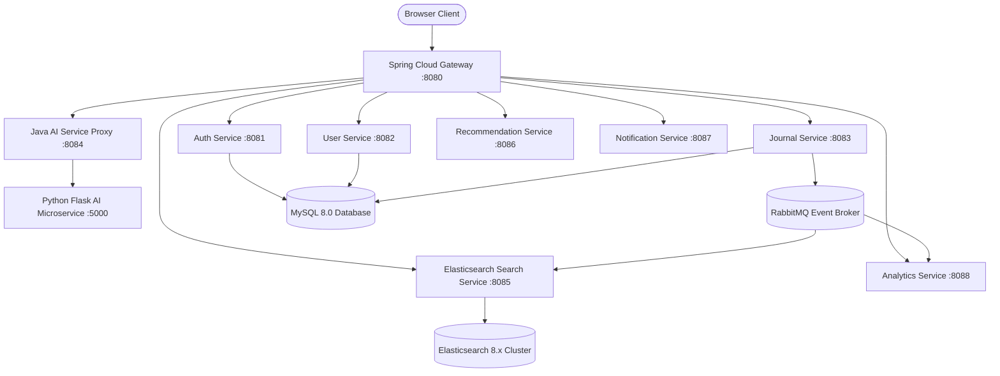

# 🚀 AI-Powered Journaling SaaS Platform

An enterprise-grade, polyglot microservices AI journaling platform engineered with **Java Spring Boot 3**, **Spring Cloud Gateway**, **Python Flask AI / Hugging Face NLP**, **Elasticsearch 8.x**, **RabbitMQ**, and a modern **React 19 + Vite** frontend.

---

## 🏛️ System Architecture



---

## ✨ Features Suite

- **⚡ Raycast Command Palette (`Cmd+K` / `Ctrl+K`)**: Instant action launcher for commands, writing tools, and theme toggling.
- **✍️ Real-Time 0ms Keystroke Mood Engine**: Classifies sentiment across 7 categories (`HAPPY 😊`, `EXCITED 🤩`, `RELAXED 😌`, `STRESSED 😰`, `SAD 🥺`, `GRATEFUL 🙏`, `ANGRY 😠`).
- **🛠️ AI Writing Assistant Suite**: Includes AI Rephrase, Fix Grammar & Spelling, AI Continue Writing, Auto-Tags, and Text Summarizer.
- **📊 Recharts Emotional Balance Radar Wheel**: 7-axis sentiment radar wheel and live positivity stream area charts.
- **🔍 Deep Elasticsearch Type-Ahead Search**: Instant keyword search filtered by mood, tags, and titles.
- **📥 Multi-Format Library Exporter**: Export journal entries to Markdown (`.md`), JSON (`.json`), and CSV (`.csv`).
- **🛡️ 10-Minute Active Session Security**: Active background session watcher enforcing 10-minute session expiration.

---

## 💻 Microservices Directory

| Microservice | Port | Tech Stack | Purpose |
| :--- | :---: | :--- | :--- |
| `gateway-service` | `8080` | Spring Cloud Gateway | API Routing & JWT Auth Filter |
| `auth-service` | `8081` | Spring Boot, JPA | User Registration & JWT Authentication |
| `user-service` | `8082` | Spring Boot, JPA | User Profiles & Settings Management |
| `journal-service` | `8083` | Spring Boot, RabbitMQ | Journal CRUD & Event Broadcasting |
| `ai-service` | `8084` | Spring Boot, RestTemplate | Java AI Proxy & Routing |
| `search-service` | `8085` | Spring Boot, Elasticsearch | Full-Text Search Indexing |
| `recommendation-service` | `8086` | Spring Boot | AI Wellness Recommendations |
| `notification-service` | `8087` | Spring Boot, RabbitMQ | Event-Driven Notifications |
| `analytics-service` | `8088` | Spring Boot, RabbitMQ | Real-Time Sentiment Metrics |
| `python-ai-service` | `5000` | Python 3.11, Flask, Hugging Face | Sentiment Classification & NLP Suite |

---

## ⚡ Quick Start (Docker Compose)

```bash
# 1. Package backend microservices
mvn clean package -DskipTests

# 2. Launch Docker Compose stack
docker-compose up --build -d
```
Access the application in your browser: **`http://localhost:3000`**

---

## 📦 Client Delivery Package
A standalone client delivery package is available at:
`AI_Journal_Platform_Client_Package.zip`
Includes 1-click launch scripts (`start_app.bat` & `start_app.sh`) and `CLIENT_HANDOFF_GUIDE.md`.
