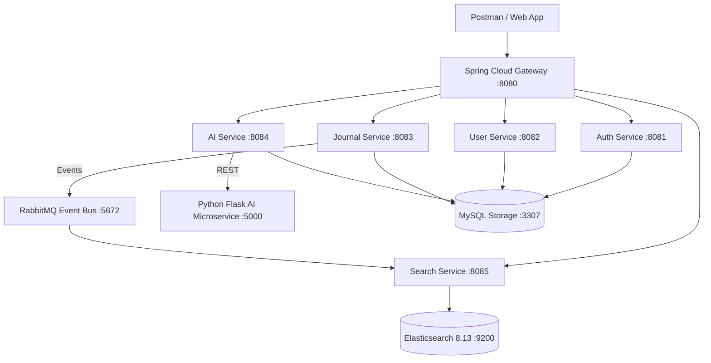

# 🧠 AI-Powered Journaling Microservices Platform

[](https://spring.io/projects/spring-boot)
[](https://www.python.org/)
[](https://flask.palletsprojects.com/)
[](https://www.elastic.co/)
[](https://www.rabbitmq.com/)
[](https://www.mysql.com/)
[](https://www.docker.com/)

A modern, enterprise-grade cloud-native microservices platform for intelligent journaling. Built using **Spring Boot 3**, **Spring Cloud (API Gateway, Eureka Discovery, Config Server)**, a dedicated **Python Flask AI Microservice**, **Elasticsearch 8.x Engine**, **Docker RabbitMQ Event Messaging**, and **Persistent MySQL Storage**.

---

## 🌟 Key Features

- **🚀 Cloud-Native Microservice Architecture**: 14 modular services orchestrated with Netflix Eureka, Spring Cloud Gateway, and Config Server.
- **🐍 Python Flask AI Microservice**: Machine learning endpoints for real-time sentiment analysis, summarization, keyword tagging, and journal recommendations.
- **😊 Dynamic Mood Emojis**: Automated mood detection mapping journal emotions to matching emojis (`HAPPY` ➔ `😊`, `EXCITED` ➔ `🤩`, `RELAXED` ➔ `😌`, `STRESSED` ➔ `😰`, `SAD` ➔ `🥺`, `GRATEFUL` ➔ `🙏`).
- **🔍 Real-Time Elasticsearch 8.x**: Asynchronous event-driven indexing via RabbitMQ for full-text and semantic journal search.
- **🔐 JWT Authentication & Security**: Secure token-based access with Spring Security and API Gateway filtering.
- **🐳 Docker Compose Deployment**: One-command orchestrator spinning up all 17 microservices & infrastructure containers.

---

## 🏗️ Architecture Overview



---

## 🛠️ Microservice Directory

| Service | Technology | Port | Description |
| :--- | :--- | :--- | :--- |
| **API Gateway** | Spring Cloud Gateway | `8080` | Unified routing, rate-limiting & JWT verification |
| **Discovery Server** | Netflix Eureka | `8761` | Service registration and discovery |
| **Config Server** | Spring Cloud Config | `8888` | Centralized external configuration manager |
| **Auth Service** | Spring Boot, Spring Security | `8081` | Registration, JWT generation & authentication |
| **User Service** | Spring Boot, JPA | `8082` | User profile & preference management |
| **Journal Service** | Spring Boot, RabbitMQ | `8083` | CRUD operations for journals & event publishing |
| **AI Service** | Spring Boot, RestTemplate | `8084` | AI strategy delegator connecting to Python Flask |
| **Python AI Service** | Python 3.11, Flask | `5000` | Machine learning sentiment, mood & summarization |
| **Search Service** | Spring Data Elasticsearch | `8085` | Asynchronous Elasticsearch 8.x indexing & search |
| **Elasticsearch** | Elasticsearch 8.13 | `9200` | High-performance search & analytics engine |
| **RabbitMQ** | RabbitMQ 3 Management | `5672` / `15672` | Inter-service asynchronous message broker |
| **MySQL Database** | MySQL 8.0 | `3307` | Relational data persistence with host volume |

---

## 🚀 Quick Start Guide

### Prerequisites
- [Docker Desktop](https://www.docker.com/products/docker-desktop) installed & running
- [Java 21 JDK](https://adoptium.net/) & [Maven 3.9+](https://maven.apache.org/)

### 1. Build All Services
```bash
mvn clean package -DskipTests
```

### 2. Launch Platform via Docker Compose
```bash
docker-compose up --build -d
```

### 3. Verify Health & Discovery
- **API Gateway**: `http://localhost:8080`
- **Eureka Dashboard**: `http://localhost:8761`
- **Python Flask AI**: `http://localhost:5000/health`
- **Elasticsearch Engine**: `http://localhost:9200`
- **RabbitMQ Dashboard**: `http://localhost:15672` *(guest / guest)*

---

## 📮 API Endpoints & Postman

Import the included Postman Collection file: [`AI_Journal_Platform.postman_collection.json`](./AI_Journal_Platform.postman_collection.json).

### Sample AI Mood Detection
```http
POST http://localhost:8080/api/v1/ai/mood
Authorization: Bearer <YOUR_JWT_TOKEN>
Content-Type: application/json

{
  "content": "Feeling super happy, accomplished, and excited about launching our Python Flask AI microservice!"
}
```

**Response**:
```json
{
  "success": true,
  "data": {
    "primaryMood": "HAPPY",
    "confidenceScore": 0.94,
    "emoji": "😊",
    "provider": "flask"
  }
}
```

---

## 📄 License
Distributed under the MIT License. See `LICENSE` for details.
