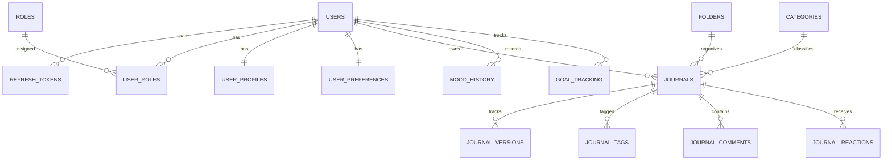

# Entity Relationship (ER) Diagram

## Database Tables Summary

- `auth_db.users`: Core user accounts & OAuth2 provider mapping.
- `auth_db.refresh_tokens`: Sliding refresh tokens with revocation support.
- `user_db.user_profiles`: User bio, avatar, location.
- `user_db.user_preferences`: Dark mode, time zone, language settings.
- `journal_db.journals`: Primary rich-text / markdown entries with metrics, pin/favorite/archive flags, encryption, and full-text index.
- `ai_db.mood_history`: Emotion detection history & confidence scores over time.
- `ai_db.goal_tracking`: Extracted goals & status tracking (Pending, Progress, Completed).
